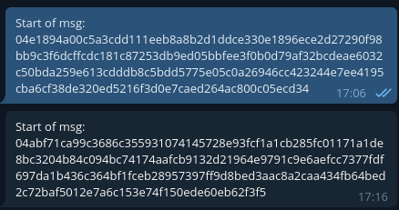

# EncryptedGram
Скрипт для зашифрованной переписки через telegram.

* Использует эллиптическое шифрование
* Имеет понятный графический интерфейс




## Установка

Тебе понадобится Python и менеджер проектов Poetry: https://python-poetry.org/

1. Клонируй репозиторий:

    ```
    git clone https://github.com/ballkicker228/EncryptedGram
    ```

2. Открой директорию с программой:

    ```
    cd EncryptedGram
    ```

3. Установи зависимости:

    ```
    poetry install
    ```

4. Запусти программу:

    ```
    poetry run main
    ```

При первом входе в аккаунт тебе понадобятся API Id и API Hash, которые можно получить на сайте https://my.telegram.org